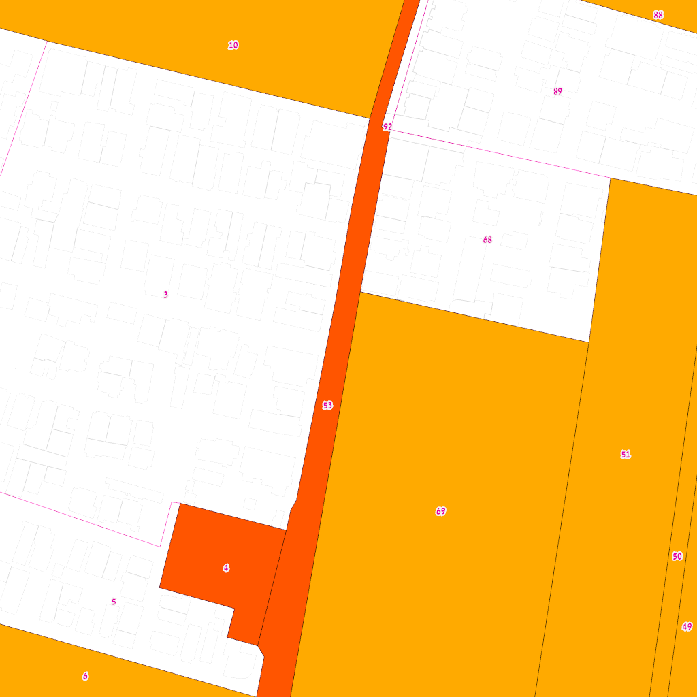
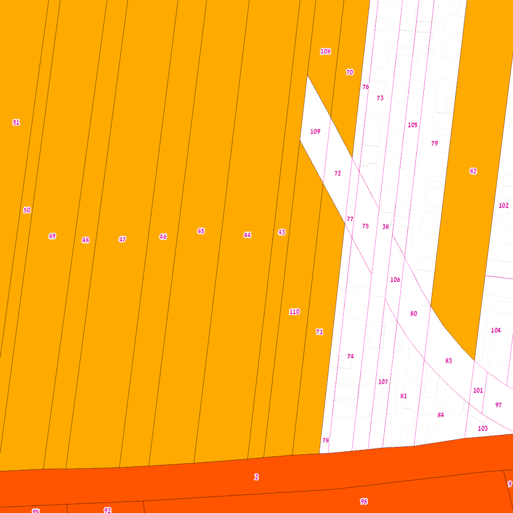
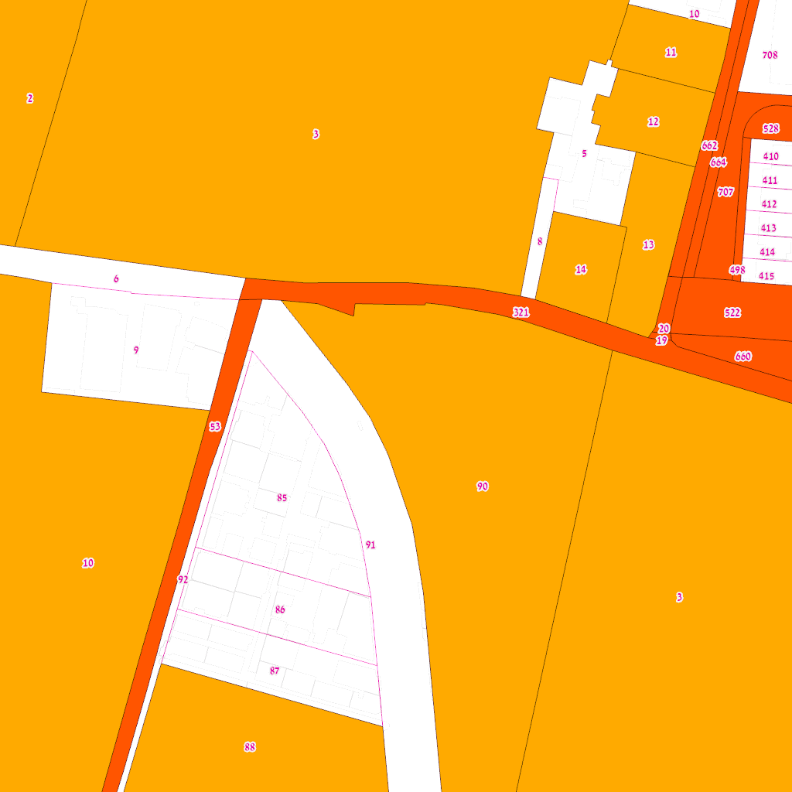
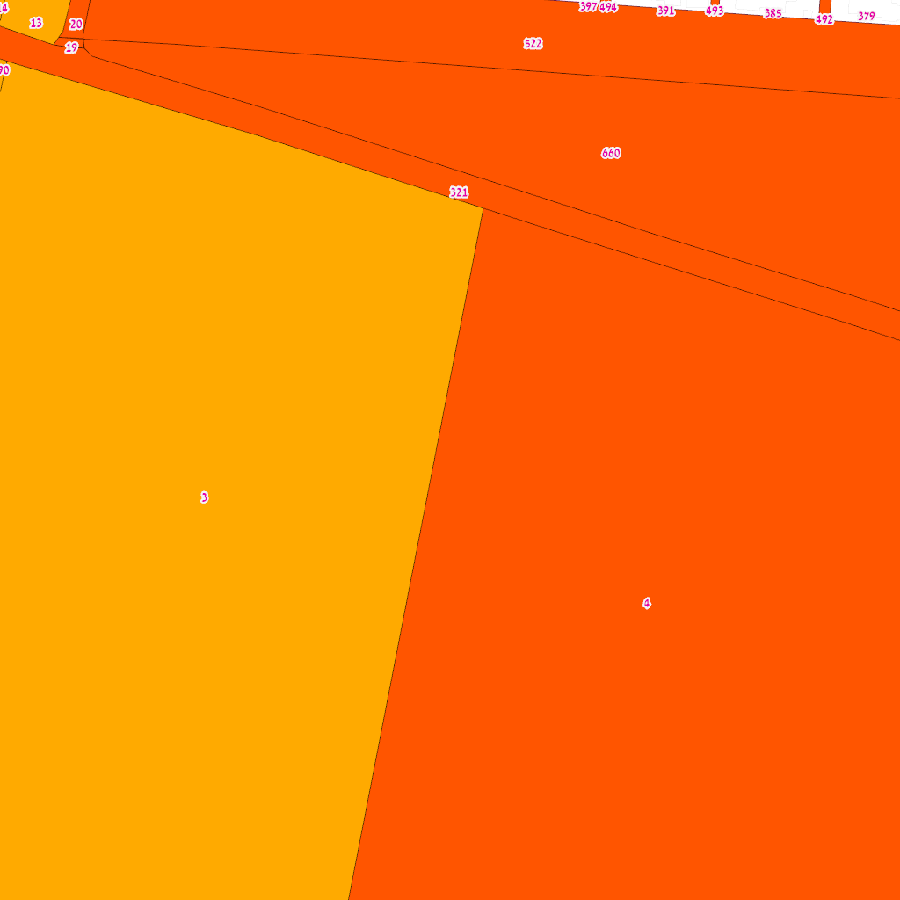
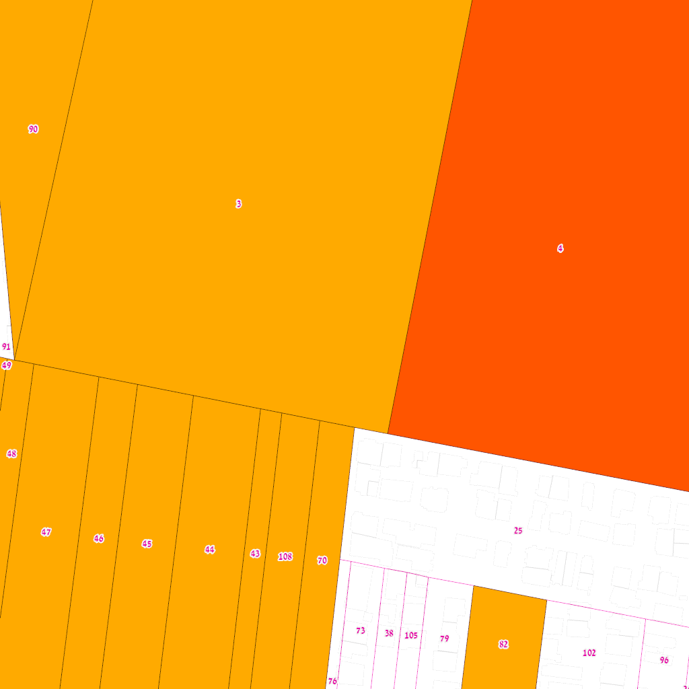

# בעלות קרקע ופרצלציה בשכונת התקווה
## מחקר לסטודיו אדריכלות — בצלאל, אקדמיה לאמנות ועיצוב

> תאריך: 30.3.2026

---

## 1. מבוא

### מטרת המחקר
מיפוי מבנה הבעלות והפרצלציה בשכונת התקווה כבסיס לפרויקטים אדריכליים ב-5 אתרי סטודיו. המחקר בוחן את מבנה החלקות, סוגי הבעלות, ייעודי הקרקע, ומגמות הפיתוח.

### מתודולוגיה
- **GIS עירוני** — שרת IView2 MapServer, עיריית תל אביב ✅ GIS_VERIFIED
  - שכבות: 524 (חלקות), 515 (בעלויות), 514 (ייעוד), 772 (היתרים), 513 (מבנים)
- **קדסטר לאומי** — GovMap WFS, שירות המדידות ✅ GOVMAP_VERIFIED
  - שכבת opendata:PARCEL_ALL — חלקות רשומות בטאבו
- **נתונים פתוחים** — data.gov.il (CKAN API) — כיסוי חלקי בלבד
- **תחום:** xmin=179800, ymin=661200, xmax=181200, ymax=662600 (Israel TM Grid / EPSG:2039)
- **הקשר תכנוני:** מבוסס על ידע מצטבר ❌ UNVERIFIED — דורש אימות מול מבא"ת

### מה ה-GIS מראה ומה לא
| מידע זמין ב-GIS ✅ | מידע חסר ❌ |
|---------------------|-------------|
| בעלות עירייה (שכבה 515) | בעלות רמ"י / קק"ל |
| גבולות חלקות ושטחים (524) | זהות הבעלים הפרטיים |
| ייעודי קרקע (514) | הבחנה בעלות/חכירה |
| היתרי בניה (772) | סטטוס מושע מפורט |
| מבנים וכתובות (513) | הערכת שווי / עסקאות |

---

## 2. ציר זמן היסטורי

| שנה | אירוע | אימות |
|------|-------|--------|
| 1920s–30s | הקמת שכונת התקווה כהתיישבות בלתי חוקית על קרקעות מנדטוריות ועירוניות | ❌ UNVERIFIED |
| 1948–50s | גל בניה מסיבי — 68 מבנים משנת 1949 בלבד (נתוני שכבה 513) | ✅ GIS_VERIFIED |
| 1965 | חוק התכנון והבנייה — סעיפים 121-122 מסדירים איחוד וחלוקה | ❌ UNVERIFIED |
| ~2000s | תכניות רה-פרצלציה ראשונות (תת"ג שונות בשדה heara של שכבה 524) | ✅ GIS_VERIFIED |
| ~2016–22 | תצ"ר (תכניות צירוף ורישום) מרובות — 286 חלקות עם הערות תכנוניות | ✅ GIS_VERIFIED |
| בתהליך | תא/5000 — תכנית מתאר כוללנית, מגדירה התחדשות עירונית בדרום ת"א | ❌ UNVERIFIED |

---

## 3. בעלות קרקע

### 3.1 בעלות עירונית (שכבה 515) ✅ GIS_VERIFIED

> **⚠️ חשוב:** שכבה 515 מציגה **רק** בעלות עירונית. אינה כוללת קרקע בבעלות רמ"י, קק"ל, או גורמים ציבוריים אחרים. "לא עירוני" ≠ "פרטי".

| נתון | ערך |
|------|-----|
| חלקות בבעלות עירייה | 483 מתוך 1541 |
| שטח עירוני | 1137.9 דונם מתוך 2895 |
| אחוז עירוני מסך השטח | 39.3% |
| שטח לא-עירוני | 1757.5 דונם |

> השטח הלא-עירוני (60.7%) עשוי לכלול: קרקע רמ"י, קק"ל, בעלות פרטית רשומה, או מושע. **לא ניתן לקבוע מה-GIS בלבד.** ❌ UNVERIFIED

#### סוגי בעלות עירונית

| סוג | חלקות | שטח (דונם) |
|-----|--------|-----------|
| בעלות חלקית | 57 | 651.2 |
| בעלות בשלמות | 415 | 477.8 |
| חכירה חלקית | 1 | 4.9 |
| חכירה בשלמות | 10 | 4.1 |

#### לפי גוש

| גוש | חלקות | שטח (דונם) | חלקות עירייה | שטח עירוני (דונם) |
|-----|--------|-----------|-------------|-----------------|
| 6013 | 5 | 784.5 | 0 | 0.0 |
| 6034 | 95 | 81.2 | 38 | 55.4 |
| 6130 | 22 | 19.3 | 18 | 12.3 |
| 6131 | 2 | 3.6 | 1 | 0.5 |
| 6134 | 248 | 186.4 | 117 | 107.5 |
| 6135 | 318 | 506.6 | 94 | 331.2 |
| 6136 | 227 | 256.3 | 55 | 82.9 |
| 6137 | 12 | 239.7 | 4 | 165.9 |
| 6892 | 50 | 114.7 | 23 | 68.2 |
| 6977 | 4 | 21.5 | 2 | 2.0 |
| 6978 | 33 | 103.5 | 25 | 97.4 |
| 6979 | 9 | 172.4 | 5 | 105.0 |
| 6980 | 16 | 99.2 | 5 | 52.6 |
| 6981 | 27 | 31.6 | 3 | 5.8 |
| 6982 | 2 | 28.2 | 0 | 0.0 |
| 7066 | 3 | 13.7 | 0 | 0.0 |
| 7068 | 118 | 81.3 | 26 | 12.5 |
| 7069 | 138 | 86.0 | 7 | 13.3 |
| 7376 | 110 | 21.4 | 21 | 7.2 |
| 7377 | 97 | 20.6 | 36 | 6.3 |
| 7423 | 5 | 23.7 | 3 | 12.0 |

### 3.2 קטגוריות בעלות — מה חסר

| קטגוריה | מקור | סטטוס |
|---------|------|--------|
| עיריית תל אביב | שכבה 515 | ✅ GIS_VERIFIED |
| רמ"י (רשות מקרקעי ישראל) | אינו בשרת GIS | ❌ UNVERIFIED — דורש בדיקה ב-land.gov.il |
| קק"ל | אינו בשרת GIS | ❌ UNVERIFIED |
| בעלות פרטית רשומה | אינו בשרת GIS | ❌ UNVERIFIED — דורש נסח טאבו |
| מושע | אינו מפורש בשרת GIS | ⚠️ INFERRED — חלקות גדולות מ-5000 מ"ר |
| חכירה | אינו בשרת GIS | ❌ UNVERIFIED |

### 3.3 הצלבה עם קדסטר לאומי (GovMap) ✅ GOVMAP_VERIFIED
> מקור: GovMap WFS — opendata:PARCEL_ALL | שירות המדידות / מרשם מקרקעין

הקדסטר הלאומי (שירות המדידות) מכיל **רק חלקות רשומות ("מוסדר")** בטאבו. חלקות שקיימות ב-GIS העירוני אך לא בקדסטר הלאומי הן חלקות שנוצרו בתכניות עירוניות (תת"ג/תצ"ר) אך טרם נרשמו בטאבו.

| גוש | TLV GIS (עירוני) | GovMap (לאומי) | רק בעירוני | סטטוס |
|-----|-----------------|----------------|-----------|--------|
| 6135 | 318 | 150 | 168 | מוסדר |
| 6978 | 33 | 19 | 14 | מוסדר |
| 6979 | 9 | 5 | 4 | מוסדר |
| 6013 | 5 | 8 | — | מוסדר |
| 6034 | 95 | 31 | 64 | מוסדר |
| 6980 | 16 | 14 | 2 | מוסדר |

> **ממצא מרכזי:** גוש 6135 מכיל 318 חלקות ב-GIS העירוני אך רק 150 בקדסטר הלאומי. **168 חלקות (53%) לא רשומות בטאבו.**
> גוש 6134 מכיל 248 חלקות ב-GIS העירוני אך **אפס** בקדסטר הלאומי — גוש שלם שאינו רשום.
> ⚠️ משמעות: חלוקת הקרקע בפועל שונה מהחלוקה הרשומה. תהליכי רה-פרצלציה בעיצומם.

---

## 4. פרצלציה

### 4.1 סקירה כללית ✅ GIS_VERIFIED
> מקור: שכבה 524, bbox: xmin=179800, ymin=661200, xmax=181200, ymax=662600

| נתון | ערך |
|------|-----|
| סה"כ חלקות | 1,541 |
| שטח כולל | 2895 דונם |
| גושים | 21 |

### 4.2 ⚠️ בעיית המושע

> **חלקות מושע** מופיעות ברישום ככלי אחד גדול אך בפועל מייצגות בעלות משותפת של עשרות בעלים.
> חלקת מושע של 37,000 מ"ר אינה "חלקה" במובן התכנוני — היא אוסף של חזקות קטנות ללא חלוקה רשומה.
> ⚠️ INFERRED — הזיהוי מבוסס על סף גודל **שרירותי** של 5000 מ"ר. סף זה נבחר כהיוריסטיקה בלבד.
> אימות סטטוס מושע בפועל דורש בדיקת נסח טאבו לכל חלקה.
>
> **חלקות-על שכונתיות:** חלקות 6135/3 (37,637 מ"ר) ו-6135/4 (37,396 מ"ר) הן חלקות מושע ענקיות שחוצות מספר אתרי סטודיו. הן מופיעות כמעט בכל ניתוח אתר, אך אין לייחס אותן לאתר בודד.

| | חלקות רגילות | חלקות חשודות כמושע |
|--|--------------|-------------------|
| כמות | 1452 | 89 |
| שטח כולל | 873 דונם | 2022 דונם |
| אחוז מהשטח | 30% | 70% |

### 4.3 התפלגות גודל חלקות (ללא מושע) ✅ GIS_VERIFIED

| גודל (מ"ר) | חלקות | שטח (דונם) | אחוז מהשטח |
|------------|--------|-----------|------------|
| < 50 | 96 | 1.9 | 0.2% |
| 50–100 | 82 | 6.4 | 0.7% |
| 100–200 | 349 | 52.8 | 6.0% |
| 200–500 | 441 | 141.3 | 16.2% |
| 500–1,000 | 262 | 173.3 | 19.8% |
| 1,000–2,500 | 154 | 258.9 | 29.7% |
| 2,500–5,000 | 68 | 238.5 | 27.3% |

> ממוצע (ללא מושע): 601 מ"ר | חציון: 270 מ"ר

### 4.4 חלקות חשודות כמושע ⚠️ INFERRED

| גוש | חלקה | שטח (מ"ר) | הערה (heara) |
|-----|------|----------|-------------|
| 6013 | 14 | 627370 | TZR-696-2016 |
| 6137 | 107 | 114635 | תתגים חופפים- 2017/ 1907, 2018/ 1035 |
| 6013 | 4 | 86346 | — |
| 6013 | 10 | 51305 | — |
| 6979 | 10 | 47239 | 1122/2019 |
| 6980 | 3 | 45030 | — |
| 6137 | 99 | 38574 | תתגים חופפים- 2017/ 1907, 2018/ 1035 |
| 6135 | 3 | 37637 | תתג 308-2021  מס עבודה 4707 |
| 6135 | 4 | 37396 | תתג 308-2021  מס עבודה 4707 |
| 6978 | 3 | 34892 | — |
| 6135 | 69 | 33877 | 3121-2018  תכנית 4764   מס עבודה 6476 |
| 6979 | 5 | 32626 | 2674-2019 |
| 6979 | 7 | 29883 | — |
| 6137 | 2 | 27179 | תתג 2017/ 1907, ספריה 4915 |
| 6982 | 2 | 24958 | — |
| 6978 | 2 | 22947 | — |
| 6034 | 91 | 22695 | תצ''ר 3029/2022 3028/2022 |
| 6136 | 36 | 22221 | — |
| 6135 | 328 | 21193 | — |
| 6979 | 3 | 19070 | 2674-2019 |
| 6013 | 3 | 18968 | — |
| 6135 | 51 | 18100 | 3121-2018  תכנית 4764   מס עבודה 6476 |
| 6980 | 15 | 17956 | 1910/2015 |
| 6136 | 17 | 17858 | 271/2020 |
| 6137 | 214 | 17842 | תתג 2018/ 1035, ספריה 4855 |

> מוצגות 25 מתוך 89 חלקות

---

## 5. מסגרת תכנונית

### 5.1 ייעודי קרקע ✅ GIS_VERIFIED
> מקור: שכבה 514

| ייעוד ראשי | מגרשים | שטח (דונם) | אחוז |
|-----------|--------|-----------|------|
| מגורים | 1252 | 848.2 | 27.3% |
| ללא סיווג | 11 | 697.5 | 22.4% |
| תחבורה | 685 | 657.5 | 21.2% |
| שטחים פתוחים | 116 | 541.4 | 17.4% |
| מבנים ומוסדות ציבור | 79 | 190.0 | 6.1% |
| אחר | 26 | 113.8 | 3.7% |
| מסחר | 45 | 26.7 | 0.9% |
| שטח לתכנון בעתיד | 23 | 12.8 | 0.4% |
| תעסוקה | 5 | 10.7 | 0.3% |
| מגורים-תעסוקה מעורב | 3 | 9.3 | 0.3% |

### 5.2 ציר זמן תכנוני מלא ✅ MAVAT_VERIFIED

| שנה | תכנית | תיאור | גוש | סטטוס |
|------|--------|-------|------|--------|
| 1958 | תא/465 | תכנית מתאר ראשונה | שכונה | בוטלה ע"י 2215 |
| ~1960 | תא/566, 566א | שינוי לתכנית 297. יזם: שיכון עובדים | 6135 | מאושרת |
| 1974 | תא/934 | תכנית מפורטת | שכונה | בוטלה ע"י 2215 |
| 1976 | תא/1692 | תכנית מפורטת | שכונה | בוטלה ע"י 2215 |
| 1982 | תא/2113 | תכנית מפורטת | שכונה | בוטלה ע"י 2215 |
| 1988 | תא/1094/ב | תכנית מפורטת | שכונה | בוטלה ע"י 2215 |
| **1992** | **תא/2215** | **"שיקום שכונת התקווה"** | **כל השכונה** | **מאושרת — בתוקף** |
| 2005 | תא/מק/2670 | תכנית מקומית | שכונה | מאושרת |
| 2008 | תא/מק/3560 | תכנית מקומית | שכונה | מאושרת |
| בתהליך | תא/5000 | מתאר עירונית כוללנית | כל ת"א | בתהליך |
| **2025** | **507-0726463** | **רה-פרצלציה, חלקה 1** | **6979** | **בתהליך** |
| **2025** | **תא/מק/4766** | **הסדרת מגרשים — 31.6 דונם** | **6135** | **בתהליך** |
| **2025** | **תא/מק/4765** | **הסדרת מגרשים — בעלות מדינה** | **6135** | **בתהליך** |
| **2025** | **תא/מק/4899** | **רה-פרצלציה** | **7069** | **בתהליך** |

### 5.3 תכנית הבסיס: תא/2215 (1992) ✅ MAVAT_VERIFIED

תכנית "שיקום שכונת התקווה" — מאושרת 26.03.1992. **זוהי תכנית הבסיס שעדיין חלה על כל השכונה.**
- שינתה/ביטלה את תכניות 465, 531, 608, 724, 706, 767, 1202, 2051, 1778, 1692, 1330, 1235, 2113, R-6, M.7, צ.פ.3/04/4
- כל זכויות הבניה הנוכחיות נגזרות ממנה
- כל תכניות הרה-פרצלציה החדשות מהוות **שינוי לתכנית 2215**

### 5.4 תא/5000 — מסגרת לתכניות חדשות ✅ MAVAT_VERIFIED

תכנית המתאר העירונית הכוללנית. כל תכניות הרה-פרצלציה מקודמות "מכוחה":
> "התכנית מקודמת על ידי ועדת המשנה המקומית... **ותואמת את הוראות תכנית המתאר העירונית תא/5000**"

### 5.5 שלוש תכניות רה-פרצלציה פעילות ✅ MAVAT_VERIFIED

> **ממצא מרכזי:** הרה-פרצלציה מתרחשת **עכשיו**, בו-זמנית בשלושה גושים. סה"כ ~52 דונם בתהליך.

| תכנית | גוש | חלקות | שטח | סוג | אתרי סטודיו |
|--------|------|--------|------|------|-------------|
| 507-0726463 | 6979 | חלקה 1 (מושע) | 12.6 ד' | איחוד וחלוקה ללא הסכמה | ✅ אתר 3, ⚠️ אתר 1 |
| תא/מק/4766 | 6135 | 79,82,96,102,104-105 | 31.6 ד' | הסדרת מגרשים | ✅ **אתר 2** (חלקה 79) |
| תא/מק/4899 | 7069 | 18, 139 | 8.2 ד' | רה-פרצלציה | — |

**תכנית 507-0726463 (גוש 6979) — פירוט:**
- ייעוד: 65.8% מגורים ב', 25.3% דרכים, 4.9% שבילים, 1.2% מבנ"צ
- צפיפות: ≥12 יח"ד/דונם | יח"ד מינימלית: 47 מ"ר
- עיצוב מיוחד: עד 5 קומות בתאי שטח נבחרים
- חזית מסחרית: דרך ההגנה — מסחר בקומת קרקע
- [צפייה במבא"ת](https://mavat.iplan.gov.il/SV4/1/5000989429/310)

### 5.6 בעלות מדינה: תא/מק/4765 ✅ MAVAT_VERIFIED

תכנית "הסדרת מגרשים בתחום הרחובות מושיע-שבתאי-נדב-בועז-הרן" (507-0893354):
- **בעלים: מדינת ישראל** — אישור רשמי לבעלות רמ"י על חלקות 25-26, גוש 6135
- שטח: 11.155 דונם
- חלקה 25 (8,689 מ"ר) נמצאת ב**אתר 5 (הורד-יחיעם-לבלוב)**
- **זהו אישור ישיר שקרקע רמ"י קיימת בשכונה — לא רק בעלות עירונית**

### 5.7 תא/566א — מקורות היסטוריים ✅ MAVAT_VERIFIED

שינוי לתכנית 297, גוש 6135, חלקות 352, 258, 15, 3, 2. יזם: **שיכון עובדים**.
חלקות 3 ו-2 הן חלקות המושע הענקיות (~37,000 מ"ר כ"א) שמופיעות כמעט בכל אתר סטודיו.

### 5.8 ראיות נוספות לרה-פרצלציה ✅ GIS_VERIFIED

> **מה-GIS:** 286 חלקות מכילות הערות תת"ג/תצ"ר — תכניות חלוקה ורישום פעילות.
> **מהקדסטר הלאומי:** 168 חלקות בגוש 6135 ו-248 בגוש 6134 קיימות רק ב-GIS העירוני — עדות לחלוקות שטרם נרשמו.

### 5.9 השפעת תכניות על אתרי סטודיו

> מיקום אתרים מכויל על ידי המשתמש (30.3.2026). קואורדינטות ב-site-locations.json.

| אתר | גושים | תכניות חופפות | ממצא |
|------|--------|-------------|------|
| **1. התקווה-חנוך-טרפון** | 6135, 6979 | **507-0726463 (חופף — גוש 6979)** | רה-פרצלציה פעילה בתחום. 84% עירייה |
| **2. תשבי-ששון** | 6135 | **4766 (חלקות 79,82,102) + 4765 (חלקה 25)** | **שתי תכניות חופפות!** רה-פרצלציה + בעלות מדינה |
| **3. דרך ההגנה** | 6134, 6135, 6978, 6979 | **507-0726463 (גוש 6979)** | רה-פרצלציה. 4 גושים, 87% עירייה |
| 4. הורד-פארק | 6134, 6135 | חלקות מושע 3,4 (566א) | **100% עירייה**. חלקות-על בלבד |
| **5. הורד-יחיעם-לבלוב** | 6135 | **תא/מק/4765 (חלקה 25)** | **בעלות מדינה מאושרת**. 91% עירייה |

> ניתוח מפורט: ראו research/taba-plans/taba-analysis.md
> מפה אינטראקטיבית: research/ownership-parcellation/map.html

---

## 6. ניתוח 5 אתרי סטודיו

> **הערה:** מספרים לצד שמות רחובות הם **כתובות** (מספרי בתים), לא מספרי חלקות.
> מספרי החלקות נקבעו לפי שאילתה מרחבית של שכבה 524. ✅ GIS_VERIFIED
> **⚠️ מושע:** חלקות מעל 5000 מ"ר מסומנות — ייתכן שהן חלקות מושע בבעלות משותפת.

### 6.1 התקווה-חנוך-טרפון
**כתובות אתר:** רחובות התקווה, חנוך, טרפון

| נתון | ערך | אימות |
|------|-----|--------|
| חלקות | 22 (7 רגילות + 15 חשודות מושע) | ✅ GIS |
| מבנים | 322 | ✅ GIS |
| בעלות עירונית | 14 חלקות, 220.2 דונם | ✅ GIS |
| היתרים פעילים | 5 | ✅ GIS |
| בניה חדשה | 4 | ✅ GIS |

#### חלקות ✅ GIS_VERIFIED

| גוש | חלקה | שטח (מ"ר) | עירייה | טאבו | מושע? | כתובות |
|-----|------|----------|--------|------|-------|--------|
| 6979 | 3 | 19070 | — | ✅ מוסדר | ⚠️ חשוד | — |
| 6135 | 3 | 37637 | ✅ | ✅ מוסדר | ⚠️ שכונתית | לבלוב 12, הונא 39, יזהר 16, לפידות 13, יזהר 11 |
| 6979 | 10 | 47239 | ✅ | ❌ לא רשום | ⚠️ חשוד | — |
| 6135 | 44 | 11584 | ✅ | ❌ לא רשום | ⚠️ חשוד | אביטל 21 |
| 6135 | 45 | 9861 | ✅ | ✅ מוסדר | ⚠️ חשוד | — |
| 6135 | 46 | 6685 | ✅ | ❌ לא רשום | ⚠️ חשוד | — |
| 6135 | 47 | 11917 | ✅ | ✅ מוסדר | ⚠️ חשוד | — |
| 6135 | 48 | 4977 | ✅ | ✅ מוסדר | — | — |
| 6135 | 49 | 11163 | ✅ | ✅ מוסדר | ⚠️ חשוד | — |
| 6135 | 50 | 2847 | ✅ | ✅ מוסדר | — | — |
| 6135 | 51 | 18100 | ✅ | ❌ לא רשום | ⚠️ חשוד | סמדר 9 |
| 6135 | 53 | 6467 | ✅ | ✅ מוסדר | ⚠️ חשוד | — |
| 6135 | 68 | 4504 | — | ✅ מוסדר | — | — |
| 6135 | 69 | 33877 | ✅ | ✅ מוסדר | ⚠️ חשוד | — |
| 6135 | 85 | 3279 | — | ✅ מוסדר | — | — |
| 6135 | 86 | 1801 | — | ✅ מוסדר | — | — |
| 6135 | 87 | 1792 | — | ✅ מוסדר | — | — |
| 6135 | 88 | 5064 | ✅ | ✅ מוסדר | ⚠️ חשוד | — |
| 6135 | 89 | 6737 | — | ✅ מוסדר | ⚠️ חשוד | — |
| 6135 | 90 | 12766 | ✅ | ❌ לא רשום | ⚠️ חשוד | — |
| 6135 | 91 | 5680 | — | ✅ מוסדר | ⚠️ חשוד | — |
| 6135 | 92 | 620 | — | ✅ מוסדר | — | — |

> 🔶 **חלקות-על שכונתיות** (6135/3, 6135/4): חלקת מושע שכונתית — חוצה מספר אתרים, אין לייחס לאתר בודד

> ⚠️ **14 חלקות נוספות חשודות כמושע** (> 5000 מ"ר): 6135/88 (5064 מ"ר), 6979/10 (47239 מ"ר), 6135/46 (6685 מ"ר), 6135/45 (9861 מ"ר), 6135/53 (6467 מ"ר), 6135/49 (11163 מ"ר), 6135/69 (33877 מ"ר), 6135/47 (11917 מ"ר), 6135/51 (18100 מ"ר), 6135/89 (6737 מ"ר), 6135/90 (12766 מ"ר), 6135/44 (11584 מ"ר), 6979/3 (19070 מ"ר), 6135/91 (5680 מ"ר)

#### ייעודי קרקע ✅ GIS_VERIFIED

| ייעוד | מגרשים | שטח (מ"ר) |
|-------|--------|----------|
| תחבורה | 37 | 76710 |
| מגורים | 19 | 53978 |
| מסחר | 15 | 16456 |
| מבנים ומוסדות ציבור | 1 | 704 |

#### היתרים פעילים ✅ GIS_VERIFIED

- **לבלוב 12** — בניה חדשה בניין מגורים לא גבוה (עד 13 מ') [קיים היתר] | יח"ד: 2
- **הונא 39** — בניה חדשה בניין מגורים לא גבוה (עד 13 מ') [קיים היתר] | יח"ד: 2
- **יזהר 16** — בניה חדשה בניין מגורים לא גבוה (עד 13 מ') [קיים היתר] | יח"ד: 3
- **לפידות 13** — שינויים חידוש היתר [קיים היתר]
- **יזהר 11** — בניה חדשה בניין מגורים לא גבוה (עד 13 מ') [קיים היתר] | יח"ד: 3

---

### 6.2 תשבי-ששון
**כתובות אתר:** תשבי 7, 4, 9, 11 | ששון 6, 8, 13

| נתון | ערך | אימות |
|------|-----|--------|
| חלקות | 23 (10 רגילות + 13 חשודות מושע) | ✅ GIS |
| מבנים | 318 | ✅ GIS |
| בעלות עירונית | 14 חלקות, 164.5 דונם | ✅ GIS |
| היתרים פעילים | 5 | ✅ GIS |
| בניה חדשה | 6 | ✅ GIS |

#### חלקות ✅ GIS_VERIFIED

| גוש | חלקה | שטח (מ"ר) | עירייה | טאבו | מושע? | כתובות |
|-----|------|----------|--------|------|-------|--------|
| 6135 | 3 | 37637 | ✅ | ✅ מוסדר | ⚠️ שכונתית | לבלוב 23 |
| 6135 | 4 | 37396 | ✅ | ✅ מוסדר | ⚠️ שכונתית | — |
| 6135 | 25 | 8689 | — | ✅ מוסדר | ⚠️ חשוד | — |
| 6135 | 38 | 3042 | — | ✅ מוסדר | — | — |
| 6135 | 43 | 3521 | ✅ | ❌ לא רשום | — | — |
| 6135 | 44 | 11584 | ✅ | ❌ לא רשום | ⚠️ חשוד | אביטל 9, אביטל 21 |
| 6135 | 45 | 9861 | ✅ | ✅ מוסדר | ⚠️ חשוד | הונא 14 |
| 6135 | 46 | 6685 | ✅ | ❌ לא רשום | ⚠️ חשוד | שמחה 12 |
| 6135 | 47 | 11917 | ✅ | ✅ מוסדר | ⚠️ חשוד | — |
| 6135 | 48 | 4977 | ✅ | ✅ מוסדר | — | קמואל 13, קמואל 15 |
| 6135 | 49 | 11163 | ✅ | ✅ מוסדר | ⚠️ חשוד | קמואל 14 |
| 6135 | 50 | 2847 | ✅ | ✅ מוסדר | — | — |
| 6135 | 70 | 3233 | ✅ | ✅ מוסדר | — | שבתאי 21 |
| 6135 | 73 | 2682 | — | ❌ לא רשום | — | — |
| 6135 | 76 | 869 | — | ❌ לא רשום | — | — |
| 6135 | 79 | 4365 | — | ✅ מוסדר | — | — |
| 6135 | 82 | 7707 | ✅ | ✅ מוסדר | ⚠️ חשוד | עברי 22ב |
| 6135 | 89 | 6737 | — | ✅ מוסדר | ⚠️ חשוד | — |
| 6135 | 90 | 12766 | ✅ | ❌ לא רשום | ⚠️ חשוד | — |
| 6135 | 91 | 5680 | — | ✅ מוסדר | ⚠️ חשוד | — |
| 6135 | 102 | 10885 | — | ✅ מוסדר | ⚠️ חשוד | — |
| 6135 | 105 | 1900 | — | ✅ מוסדר | — | — |
| 6135 | 108 | 3194 | ✅ | ✅ מוסדר | — | — |

> 🔶 **חלקות-על שכונתיות** (6135/3, 6135/4): חלקת מושע שכונתית — חוצה מספר אתרים, אין לייחס לאתר בודד

> ⚠️ **11 חלקות נוספות חשודות כמושע** (> 5000 מ"ר): 6135/82 (7707 מ"ר), 6135/102 (10885 מ"ר), 6135/46 (6685 מ"ר), 6135/45 (9861 מ"ר), 6135/49 (11163 מ"ר), 6135/47 (11917 מ"ר), 6135/89 (6737 מ"ר), 6135/90 (12766 מ"ר), 6135/25 (8689 מ"ר), 6135/44 (11584 מ"ר), 6135/91 (5680 מ"ר)

#### ייעודי קרקע ✅ GIS_VERIFIED

| ייעוד | מגרשים | שטח (מ"ר) |
|-------|--------|----------|
| מגורים | 25 | 76057 |
| תחבורה | 19 | 49600 |
| שטחים פתוחים | 1 | 41066 |
| מבנים ומוסדות ציבור | 2 | 9305 |
| מסחר | 1 | 1037 |

#### היתרים פעילים ✅ GIS_VERIFIED

- **קמואל 13** — בניה חדשה בניין מגורים לא גבוה (עד 13 מ') [בתהליך היתר] | יח"ד: 3
- **שבתאי 21** — תוספות בניה תוספת בניה לפי תכנית הרחבה [בבניה] | יח"ד: 1
- **קמואל 14** — שימוש חורג שמוש חורג לעסקים [בתהליך היתר]
- **קמואל 15** — בניה חדשה בניין מגורים לא גבוה (עד 13 מ') [בתהליך היתר] | יח"ד: 3
- **שמחה 12** — בניה חדשה בניין מגורים לא גבוה (עד 13 מ') [בתהליך היתר] | יח"ד: 2

---

### 6.3 דרך ההגנה
**כתובות אתר:** ציר דרך ההגנה

| נתון | ערך | אימות |
|------|-----|--------|
| חלקות | 26 (16 רגילות + 10 חשודות מושע) | ✅ GIS |
| מבנים | 272 | ✅ GIS |
| בעלות עירונית | 16 חלקות, 180.3 דונם | ✅ GIS |
| היתרים פעילים | 11 | ✅ GIS |
| בניה חדשה | 10 | ✅ GIS |

#### חלקות ✅ GIS_VERIFIED

| גוש | חלקה | שטח (מ"ר) | עירייה | טאבו | מושע? | כתובות |
|-----|------|----------|--------|------|-------|--------|
| 6978 | 3 | 34892 | ✅ | ❌ לא רשום | ⚠️ חשוד | דרך ההגנה 75 |
| 6135 | 3 | 37637 | ✅ | ✅ מוסדר | ⚠️ שכונתית | יזהר 4, יזהר 1א, אחיעזר 4, אחיעזר 6, הונא 39, יזהר 16, יזהר 11 |
| 6978 | 5 | 1383 | — | ✅ מוסדר | — | — |
| 6978 | 6 | 2270 | — | ❌ לא רשום | — | — |
| 6978 | 8 | 275 | — | ✅ מוסדר | — | — |
| 6979 | 9 | 2820 | — | ❌ לא רשום | — | — |
| 6979 | 10 | 47239 | ✅ | ❌ לא רשום | ⚠️ חשוד | — |
| 6978 | 13 | 1361 | ✅ | ✅ מוסדר | — | — |
| 6978 | 14 | 1014 | ✅ | ✅ מוסדר | — | — |
| 6134 | 19 | 21 | ✅ | ❌ לא רשום | — | — |
| 6134 | 20 | 123 | ✅ | ❌ לא רשום | — | — |
| 6135 | 53 | 6467 | ✅ | ✅ מוסדר | ⚠️ חשוד | — |
| 6135 | 85 | 3279 | — | ✅ מוסדר | — | — |
| 6135 | 86 | 1801 | — | ✅ מוסדר | — | — |
| 6135 | 87 | 1792 | — | ✅ מוסדר | — | — |
| 6135 | 88 | 5064 | ✅ | ✅ מוסדר | ⚠️ חשוד | — |
| 6135 | 89 | 6737 | — | ✅ מוסדר | ⚠️ חשוד | — |
| 6135 | 90 | 12766 | ✅ | ❌ לא רשום | ⚠️ חשוד | דרך ההגנה 86א, אצ"ל 3, אצ"ל 5, אצ"ל 3 |
| 6135 | 91 | 5680 | — | ✅ מוסדר | ⚠️ חשוד | — |
| 6135 | 92 | 620 | — | ✅ מוסדר | — | — |
| 6135 | 321 | 4229 | ✅ | ❌ לא רשום | — | — |
| 6134 | 522 | 11265 | ✅ | ❌ לא רשום | ⚠️ חשוד | — |
| 6134 | 660 | 15878 | ✅ | ❌ לא רשום | ⚠️ חשוד | — |
| 6134 | 662 | 858 | ✅ | ❌ לא רשום | — | — |
| 6134 | 664 | 675 | ✅ | ❌ לא רשום | — | — |
| 6134 | 707 | 772 | ✅ | ❌ לא רשום | — | — |

> 🔶 **חלקות-על שכונתיות** (6135/3, 6135/4): חלקת מושע שכונתית — חוצה מספר אתרים, אין לייחס לאתר בודד

> ⚠️ **9 חלקות נוספות חשודות כמושע** (> 5000 מ"ר): 6134/660 (15878 מ"ר), 6135/88 (5064 מ"ר), 6979/10 (47239 מ"ר), 6978/3 (34892 מ"ר), 6135/53 (6467 מ"ר), 6135/89 (6737 מ"ר), 6135/90 (12766 מ"ר), 6134/522 (11265 מ"ר), 6135/91 (5680 מ"ר)

#### ייעודי קרקע ✅ GIS_VERIFIED

| ייעוד | מגרשים | שטח (מ"ר) |
|-------|--------|----------|
| תחבורה | 40 | 60410 |
| מגורים | 15 | 37593 |
| מסחר | 28 | 19888 |
| שטחים פתוחים | 1 | 1673 |
| אחר | 1 | 1639 |
| מבנים ומוסדות ציבור | 1 | 704 |

#### היתרים פעילים ✅ GIS_VERIFIED

- **יזהר 4** — בניה חדשה בניין מגורים לא גבוה (עד 13 מ') [בתהליך היתר] | יח"ד: 3
- **דרך ההגנה 86א, אצ"ל 3, אצ"ל 5** — בניה חדשה בניין מגורים מעל X קומות מסחריות , תוספות בניה הריסה [בתהליך היתר] | יח"ד: 11
- **דרך ההגנה 86א, אצ"ל 3, אצ"ל 5** — בניה חדשה בניין מגורים מעל X קומות מסחריות , תוספות בניה הריסה [בתהליך היתר] | יח"ד: 11
- **יזהר 1א** — בניה חדשה בניין מגורים לא גבוה (עד 13 מ') [בבניה] | יח"ד: 2
- **אצ"ל 3** — שימוש חורג שימוש חורג למסחר/מסעדה/גן ילדים פרטי או בניין עם ערוב שימושים [בתהליך היתר]
- **אחיעזר 4** — בניה חדשה בניין מגורים לא גבוה (עד 13 מ') [בתהליך היתר] | יח"ד: 6
- **אחיעזר 6** — בניה חדשה בניין מגורים לא גבוה (עד 13 מ') [בתהליך היתר] | יח"ד: 3
- **דרך ההגנה 75** — בניה חדשה בנייה חדשה תמ"א 38 [בתהליך היתר] | יח"ד: 8 | תמ"א 38
- **הונא 39** — בניה חדשה בניין מגורים לא גבוה (עד 13 מ') [קיים היתר] | יח"ד: 2
- **יזהר 16** — בניה חדשה בניין מגורים לא גבוה (עד 13 מ') [קיים היתר] | יח"ד: 3
- **יזהר 11** — בניה חדשה בניין מגורים לא גבוה (עד 13 מ') [קיים היתר] | יח"ד: 3

---

### 6.4 הורד-פארק
**כתובות אתר:** הורד 6, הורד 9

| נתון | ערך | אימות |
|------|-----|--------|
| חלקות | 6 (1 רגילות + 5 חשודות מושע) | ✅ GIS |
| מבנים | 224 | ✅ GIS |
| בעלות עירונית | 6 חלקות, 119.2 דונם | ✅ GIS |
| היתרים פעילים | 13 | ✅ GIS |
| בניה חדשה | 10 | ✅ GIS |

#### חלקות ✅ GIS_VERIFIED

| גוש | חלקה | שטח (מ"ר) | עירייה | טאבו | מושע? | כתובות |
|-----|------|----------|--------|------|-------|--------|
| 6135 | 3 | 37637 | ✅ | ✅ מוסדר | ⚠️ שכונתית | יזהר 4, יזהר 1א, אחיעזר 4, אחיעזר 6, לבלוב 12, יחיעם 26, הונא 39, ורד 10, יחיעם 28, יזהר 16, יזהר 11 |
| 6135 | 4 | 37396 | ✅ | ✅ מוסדר | ⚠️ שכונתית | — |
| 6135 | 90 | 12766 | ✅ | ❌ לא רשום | ⚠️ חשוד | — |
| 6135 | 321 | 4229 | ✅ | ❌ לא רשום | — | — |
| 6134 | 522 | 11265 | ✅ | ❌ לא רשום | ⚠️ חשוד | — |
| 6134 | 660 | 15878 | ✅ | ❌ לא רשום | ⚠️ חשוד | — |

> 🔶 **חלקות-על שכונתיות** (6135/3, 6135/4): חלקת מושע שכונתית — חוצה מספר אתרים, אין לייחס לאתר בודד

> ⚠️ **3 חלקות נוספות חשודות כמושע** (> 5000 מ"ר): 6134/660 (15878 מ"ר), 6135/90 (12766 מ"ר), 6134/522 (11265 מ"ר)

#### ייעודי קרקע ✅ GIS_VERIFIED

| ייעוד | מגרשים | שטח (מ"ר) |
|-------|--------|----------|
| שטחים פתוחים | 4 | 43070 |
| מגורים | 11 | 40442 |
| מבנים ומוסדות ציבור | 8 | 17798 |
| תחבורה | 4 | 17272 |

#### היתרים פעילים ✅ GIS_VERIFIED

- **יזהר 4** — בניה חדשה בניין מגורים לא גבוה (עד 13 מ') [בתהליך היתר] | יח"ד: 3
- **יזהר 1א** — בניה חדשה בניין מגורים לא גבוה (עד 13 מ') [בבניה] | יח"ד: 2
- **אחיעזר 4** — בניה חדשה בניין מגורים לא גבוה (עד 13 מ') [בתהליך היתר] | יח"ד: 6
- **אחיעזר 6** — בניה חדשה בניין מגורים לא גבוה (עד 13 מ') [בתהליך היתר] | יח"ד: 3
- **לבלוב 12** — בניה חדשה בניין מגורים לא גבוה (עד 13 מ') [קיים היתר] | יח"ד: 2
- **יחיעם 26** — שינויים חידוש היתר [בבניה]
- **הונא 39** — בניה חדשה בניין מגורים לא גבוה (עד 13 מ') [קיים היתר] | יח"ד: 2
- **ורד 10** — שינויים חידוש היתר [קיים היתר]
- **יחיעם 28** — שינויים חידוש היתר [בבניה]
- **יזהר 16** — בניה חדשה בניין מגורים לא גבוה (עד 13 מ') [קיים היתר] | יח"ד: 3
- **יחיעם 26** — בניה חדשה בניין מגורים לא גבוה (עד 13 מ') [בבניה] | יח"ד: 2
- **יחיעם 28** — בניה חדשה בניין מגורים לא גבוה (עד 13 מ') [בבניה] | יח"ד: 2
- **יזהר 11** — בניה חדשה בניין מגורים לא גבוה (עד 13 מ') [קיים היתר] | יח"ד: 3

---

### 6.5 הורד-יחיעם-לבלוב
**כתובות אתר:** ורד 29, יחיעם 31, לבלוב 23

| נתון | ערך | אימות |
|------|-----|--------|
| חלקות | 14 (4 רגילות + 10 חשודות מושע) | ✅ GIS |
| מבנים | 297 | ✅ GIS |
| בעלות עירונית | 12 חלקות, 153.9 דונם | ✅ GIS |
| היתרים פעילים | 10 | ✅ GIS |
| בניה חדשה | 7 | ✅ GIS |

#### חלקות ✅ GIS_VERIFIED

| גוש | חלקה | שטח (מ"ר) | עירייה | טאבו | מושע? | כתובות |
|-----|------|----------|--------|------|-------|--------|
| 6135 | 3 | 37637 | ✅ | ✅ מוסדר | ⚠️ שכונתית | לבלוב 23, לבלוב 12, יחיעם 26, הונא 39, ורד 10, יחיעם 28, יזהר 16, לפידות 13, יזהר 11 |
| 6135 | 4 | 37396 | ✅ | ✅ מוסדר | ⚠️ שכונתית | — |
| 6135 | 25 | 8689 | — | ✅ מוסדר | ⚠️ חשוד | — |
| 6135 | 43 | 3521 | ✅ | ❌ לא רשום | — | — |
| 6135 | 44 | 11584 | ✅ | ❌ לא רשום | ⚠️ חשוד | אביטל 21 |
| 6135 | 45 | 9861 | ✅ | ✅ מוסדר | ⚠️ חשוד | — |
| 6135 | 46 | 6685 | ✅ | ❌ לא רשום | ⚠️ חשוד | — |
| 6135 | 47 | 11917 | ✅ | ✅ מוסדר | ⚠️ חשוד | — |
| 6135 | 48 | 4977 | ✅ | ✅ מוסדר | — | — |
| 6135 | 49 | 11163 | ✅ | ✅ מוסדר | ⚠️ חשוד | — |
| 6135 | 70 | 3233 | ✅ | ✅ מוסדר | — | — |
| 6135 | 90 | 12766 | ✅ | ❌ לא רשום | ⚠️ חשוד | — |
| 6135 | 91 | 5680 | — | ✅ מוסדר | ⚠️ חשוד | — |
| 6135 | 108 | 3194 | ✅ | ✅ מוסדר | — | — |

> 🔶 **חלקות-על שכונתיות** (6135/3, 6135/4): חלקת מושע שכונתית — חוצה מספר אתרים, אין לייחס לאתר בודד

> ⚠️ **8 חלקות נוספות חשודות כמושע** (> 5000 מ"ר): 6135/46 (6685 מ"ר), 6135/45 (9861 מ"ר), 6135/49 (11163 מ"ר), 6135/47 (11917 מ"ר), 6135/90 (12766 מ"ר), 6135/25 (8689 מ"ר), 6135/44 (11584 מ"ר), 6135/91 (5680 מ"ר)

#### ייעודי קרקע ✅ GIS_VERIFIED

| ייעוד | מגרשים | שטח (מ"ר) |
|-------|--------|----------|
| מגורים | 20 | 66133 |
| תחבורה | 14 | 43013 |
| שטחים פתוחים | 1 | 41066 |
| מבנים ומוסדות ציבור | 3 | 11207 |

#### היתרים פעילים ✅ GIS_VERIFIED

- **לבלוב 12** — בניה חדשה בניין מגורים לא גבוה (עד 13 מ') [קיים היתר] | יח"ד: 2
- **יחיעם 26** — שינויים חידוש היתר [בבניה]
- **הונא 39** — בניה חדשה בניין מגורים לא גבוה (עד 13 מ') [קיים היתר] | יח"ד: 2
- **ורד 10** — שינויים חידוש היתר [קיים היתר]
- **יחיעם 28** — שינויים חידוש היתר [בבניה]
- **יזהר 16** — בניה חדשה בניין מגורים לא גבוה (עד 13 מ') [קיים היתר] | יח"ד: 3
- **לפידות 13** — שינויים חידוש היתר [קיים היתר]
- **יחיעם 26** — בניה חדשה בניין מגורים לא גבוה (עד 13 מ') [בבניה] | יח"ד: 2
- **יחיעם 28** — בניה חדשה בניין מגורים לא גבוה (עד 13 מ') [בבניה] | יח"ד: 2
- **יזהר 11** — בניה חדשה בניין מגורים לא גבוה (עד 13 מ') [קיים היתר] | יח"ד: 3

---

## 7. שאלות פתוחות ומקורות

### שאלות לבירור שטח ❌ UNVERIFIED

1. **בעלות רמ"י:** מהו חלקה של רמ"י (מינהל מקרקעי ישראל) מכלל הקרקע בשכונה? שכבה 515 מציגה רק בעלות עירונית.
2. **מושע:** אילו מהחלקות הגדולות (> 5000 מ"ר) הן בפועל חלקות מושע? יש לאמת מול נסח טאבו.
3. **חכירה:** מהו חלק הקרקע בחכירה לעומת בעלות מלאה? לא ניתן לדעת מה-GIS.
4. **תא/5000:** מהו הסטטוס העדכני של התכנית? מה הם ייעודי הקרקע המוצעים לשכונה?
5. **רה-פרצלציה:** האם קיימות תכניות איחוד וחלוקה מאושרות או בתהליך? (בדיקה במבא"ת)
6. **פינוי-בינוי:** האם קיימים מתחמים מוכרזים בשכונה?

### מקורות

#### מקורות אומתו ✅
- שרת GIS עיריית תל אביב: `https://gisn.tel-aviv.gov.il/arcgis/rest/services/IView2/MapServer`
  - שכבה 515: בעלויות עירייה (483 רשומות)
  - שכבה 524: חלקות (1541 רשומות)
  - שכבה 514: ייעודי קרקע (2245 רשומות)
  - שכבה 772: היתרי בניה
  - שכבה 513: מבנים
  - bbox: xmin=179800, ymin=661200, xmax=181200, ymax=662600

#### מקורות לא אומתו ❌
- מערכת מבא"ת: https://mavat.iplan.gov.il — לבדיקת תכניות תא/5000
- רשות מקרקעי ישראל: https://land.gov.il — לבדיקת בעלות רמ"י
- לשכת רישום מקרקעין (טאבו) — נסחים לאימות בעלות ומושע
- ויקיפדיה — שכונת התקווה (רקע היסטורי)
